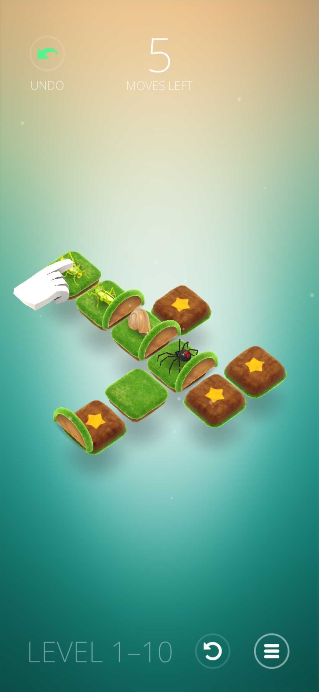

## Humbug - Genius Puzzle Solver

> Humbug - Genuis Puzzle, is a logical puzzle game, available as an android/iOS app. [Here](https://play.google.com/store/apps/details?id=com.dunderbit.humbug&hl=en_IN&gl=US&pli=1).  

<iframe width="679" height="382" src="https://www.youtube.com/embed/NB-Pghq9JsE" title="Humbug by Dunderbit - Official Trailer (iOS &amp; Android)" frameborder="0" allow="accelerometer; autoplay; clipboard-write; encrypted-media; gyroscope; picture-in-picture; web-share" referrerpolicy="strict-origin-when-cross-origin" allowfullscreen></iframe>

This program can be used to solve the levels 1-90 of the game. Pull requests are welcome for more levels :).

### Instructions:
- Download the Humbug Puzzle app.
- Clone this repository to your device. 
- On terminal, run this command:  
```  
bash run.sh <maxMoves> testcases/<levelNumber>.txt
```
- Follow the steps printed in terminal, and proceed to the next level.  
   
Each level should not take more than 15 seconds to solve. In fact, except two levels, most will be solve under 5 seconds.  

### Encoding the levels

This section details how the levels of the app have been encoded before being processed by code. Future developers can feel free to extend this.

Consider level 10 :


The game state is represented as a matrix. The input will be given as a matrix. The matrix elements can belong to the above classes.   

. -> no boundary wall, empty space
X -> Normal block  
Y -> Target block  
W -> Wall  
P -> Spider   
G -> Grasshopper  
S -> Snail   
L -> LadyBug   
B -> Butterfly  
H -> HoneyBee

If the grid is n\*m, then the matrix size is (2n+1)\*(2m+1). The tiles of game are present in (odd, odd) indices. Rest are to store walls.  

Refer sample_image.jpg. The top left of matrix is the west corner of the image grid in game.

The test case files consist of this grid, and the last line contains the number of moves to solve the level as per the original game.

Sample Encoding:  
...........  
.....Y...Y.  
...........  
.G.GWSWPWY.  
...........  
.......X...  
...........  
.......Y...  
.......W...  

